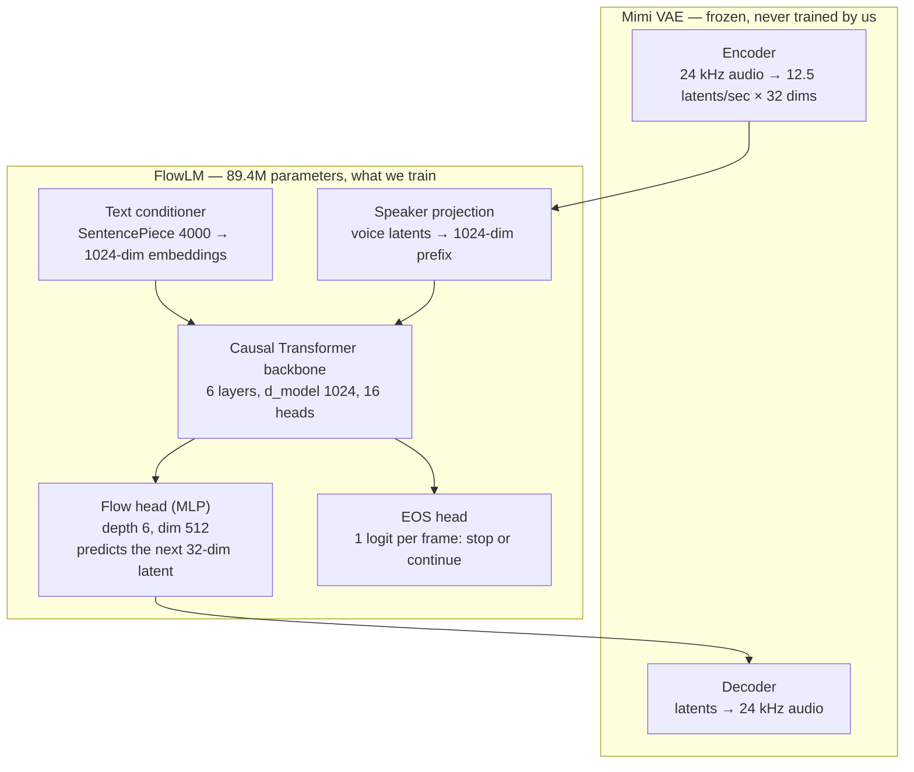
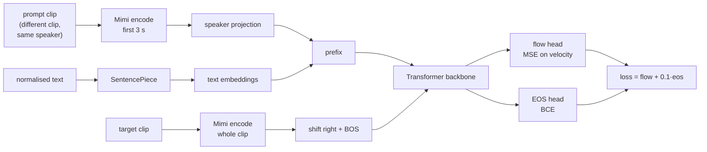

# Pocket TTS — architecture, and the life of one audio sample

Written for a team walkthrough. Everything here is taken from the paper in this folder
(`2025_kyutai_pocket-tts.pdf`) and from the code in this repo, not from memory.

- Paper: Rouard, Orsini, Roebel, Zeghidour, Défossez — *Continuous Audio Language Models*,
  Kyutai. arXiv:2509.06926. Pocket TTS is the 100M-parameter TTS model released with it.
- Model config we run: `pocket_tts/config/english.yaml`
- Our Hebrew training code: `hebrew_training/`

---

## 1. The one idea worth leading with

Almost every audio LM turns sound into **discrete tokens** using a codec like RVQ, then
predicts those tokens like words. Discretisation is lossy, so better audio needs more
tokens per second, which costs compute. That is the trade-off Pocket TTS removes.

Pocket TTS predicts **continuous vectors** instead. Each 80 ms of audio is one vector of
32 floats produced by a VAE. Nothing is quantised, so there is no fidelity/bitrate
trade-off, and one frame is one prediction rather than a stack of 8 codebook tokens.

The catch: you cannot use a softmax over a vocabulary to predict a continuous vector. So
the model predicts it with a small **flow-matching MLP head** instead — the same family of
maths as diffusion, but arranged to give a good sample in one step.

> Paper, Table 1: their 32-dimensional VAE matches an 8-RVQ Mimi codec on acoustic quality
> and beats it on phonetic discriminability, at 12.5 Hz.

---

## 2. The pieces



| piece | what it does | trained? |
|---|---|---|
| Mimi VAE encoder/decoder | audio ↔ 32-dim latents at 12.5 Hz | **frozen** |
| Text conditioner | 4,000-piece SentencePiece → embeddings | trained |
| Speaker projection | turns the voice prompt's latents into a prefix | trained |
| Transformer backbone | reads prefix + latents so far, emits a context vector per frame | trained |
| Flow head | turns that context vector into the actual next latent | trained |
| EOS head | decides when the utterance is finished | trained |

**Frame rate is the number to remember: 12.5 Hz, so one frame is 80 ms.** A 7-second clip
is about 88 frames. Everything downstream is counted in frames.

Pocket TTS itself is the *student* of a distillation: the paper trains a 24-layer teacher
and distils it to the 6-layer model we use, which is why it runs faster than real time on
a laptop CPU.

---

## 3. Life of a training sample

Take one real recording and follow it all the way to a gradient.

### 3.1 Raw recording → clips

Input is one CrowdRecital session: `audio.wav` plus `transcript.aligned.json` with
word-level timings and per-word confidence.

1. **Slice** into 4–16 second clips, targeting an 8 s average, cutting only on sentence
   boundaries so no clip ends mid-word.
2. **Quality filter** on the median word confidence, both per session and per clip.
3. **Normalise text**: expand numbers to spoken Hebrew, keep punctuation.

Why 8 seconds: the trainer samples at most `--head-samples 128` frames per loss step, and
128 frames ÷ 12.5 Hz = **10.24 seconds**. Clips under that get every frame into the loss.
Longer clips get randomly subsampled, so part of them is wasted each step.

### 3.2 Clip → training row

Each clip becomes a row with a **prompt clip** attached — a *different* recording of the
*same speaker*.

This is the part most worth explaining to the team, because getting it wrong silently
breaks the whole objective. The model's job is: *given someone's voice and some text,
speak that text in that voice*. If the voice prompt is taken from the very clip you are
asking it to reproduce, the answer is hidden inside the question and the model can lean on
it instead of learning to transfer a voice.

```
row = {
  audio_path         : the clip to reproduce      (the target)
  text               : its normalised transcript
  prompt_audio_path  : a DIFFERENT clip, SAME speaker   (the voice)
  speaker_id         : user_id from the session metadata
}
```

### 3.3 Row → cached latents

Mimi is frozen, so its output never changes and we encode once up front rather than every
epoch:

- **target latents**: whole clip → `(frames, 32)`, then normalised by the model's stored
  `emb_mean` / `emb_std`
- **prompt latents**: first 3 s of the prompt clip → `(≈38, 32)`, kept raw

Both are stored as float16, about 9.7 KB per row.

### 3.4 Latents → loss

Per training step, batch size 1, gradient accumulation 8:

1. Build the **prefix**: `[BOS] + speaker_projection(prompt latents) + text embeddings`.
2. Build the **teacher-forced input**: the target latents shifted right by one, with a BOS
   latent in front — so at frame *s* the model sees frames 1…*s*−1 and must produce *s*.
3. Run the backbone once over `prefix + shifted target` → one 1024-dim context vector per
   frame.
4. Sample up to 128 frames. For each, the **flow-matching** step:
   - draw noise `ε ~ N(0, I)` and a time `t ~ U(0,1)`
   - interpolate `x_t = (1−t)·ε + t·clean`
   - the head, conditioned on the frame's context vector, predicts the velocity
   - loss is MSE against the true velocity `clean − ε`

   In words: the head learns the direction that carries pure noise to the true latent.
   At generation time you follow that direction to get a latent from noise.
5. **EOS head**: binary cross-entropy over frames, target 1 on the last frame only, with a
   positive weight so the single stop frame is not drowned by the many continue frames.
6. Total: `flow_loss + 0.1 × eos_loss`.



**Note for the team:** this local trainer optimises flow-matching MSE plus EOS. The paper's
recipe is a 75/25 mixture of flow matching and Lagrangian Self-Distillation. We have not
implemented LSD, so this is a working adaptation, **not** a reproduction of Kyutai's
training.

---

## 4. Life of an inference sample

Generation runs the same machinery forward, one frame at a time.

1. **Voice prompt**: encode a few seconds of the target speaker with Mimi, project it, and
   that becomes the prefix. Cached, so the same voice is not re-encoded per request.
2. **Text**: tokenise and append to the prefix.
3. **Loop, per 80 ms frame**:
   - backbone consumes the previous latent and its KV cache → context vector
   - flow head turns noise into the next latent, conditioned on that vector
   - EOS head says whether to stop
   - the latent is fed back in as the next input
4. **Decode**: Mimi's decoder turns the latent stream into 24 kHz audio. Because it is
   streaming, audio comes out while later frames are still being generated.

The whole model is stateful and causal, which is what makes it stream on CPU. Batch size
is always 1 and the code is not thread-safe.

---

## 5. What we changed for Hebrew

| area | stock Pocket TTS | ours |
|---|---|---|
| tokenizer | English SentencePiece | Hebrew SentencePiece, 4,000 pieces, trained on our corpus |
| voice prompt in training | n/a | a different clip from the same speaker |
| train/val split | n/a | grouped by `user_id`, so no speaker appears on both sides |
| validation size | 8 clips | 64 fixed clips across ~20 held-out speakers |
| metrics | console only | `metrics.jsonl`, one row per log and per eval |

When the Hebrew tokenizer is installed, embeddings for pieces shared with the base
tokenizer are carried over — 395 pieces in our case — so the model does not start from
scratch on those.

---

## 6. Our numbers

| | |
|---|---|
| corpus | 2,398 CrowdRecital recordings, 50.5 h raw |
| dataset | 19,715 clips, 38.90 h, 83 speakers |
| train / validation | 19,084 clips (37.7 h, 60 speakers) / 628 clips (1.2 h, 20 speakers) |
| clip duration | mean 7.10 s, p95 10.14 s, max 14.62 s |
| latents | 201 MB, float16 |
| trainable parameters | 89,447,489 (Mimi frozen) |
| hardware | RTX 4060 Laptop, 8 GB |
| speed | 1.08 s/step, so 20,000 steps ≈ 6 h |
| checkpoint | 1.0 GB each |

---

## 7. Two honest caveats

1. **83 speakers is a small pool for voice cloning**, and the top 10 speakers hold about
   48% of the audio. Speaker-similarity results should be read with that in mind.
2. **Loss is not intelligibility.** Flow-matching MSE going down does not prove the speech
   is understandable. Judge checkpoints by listening to fixed sentences in held-out voices
   — that is what `hebrew_training/generate_samples.py` produces.
